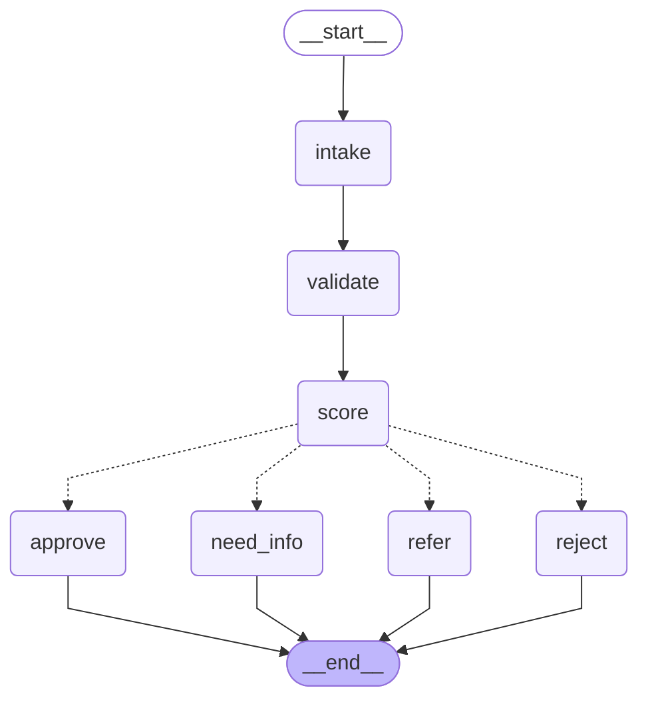

# Loan pre-screening graph

```mermaid
---
config:
  flowchart:
    curve: linear
---
graph TD;
	__start__([<p>__start__</p>]):::first
	intake(intake)
	validate(validate)
	score(score)
	approve(approve)
	refer(refer)
	reject(reject)
	need_info(need_info)
	__end__([<p>__end__</p>]):::last
	__start__ --> intake;
	intake --> validate;
	score -.-> approve;
	score -.-> need_info;
	score -.-> refer;
	score -.-> reject;
	validate --> score;
	approve --> __end__;
	need_info --> __end__;
	refer --> __end__;
	reject --> __end__;
	classDef default fill:#f2f0ff,line-height:1.2
	classDef first fill-opacity:0
	classDef last fill:#bfb6fc
```
