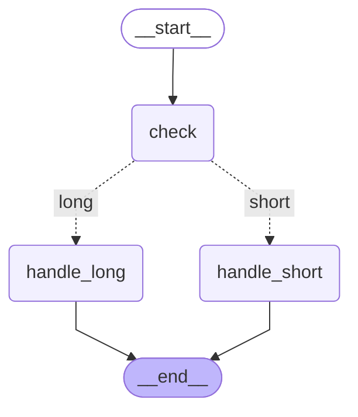

```mermaid
---
config:
  flowchart:
    curve: linear
---
graph TD;
	__start__([<p>__start__</p>]):::first
	check(check)
	handle_short(handle_short)
	handle_long(handle_long)
	__end__([<p>__end__</p>]):::last
	__start__ --> check;
	check -. &nbsp;long&nbsp; .-> handle_long;
	check -. &nbsp;short&nbsp; .-> handle_short;
	handle_long --> __end__;
	handle_short --> __end__;
	classDef default fill:#f2f0ff,line-height:1.2
	classDef first fill-opacity:0
	classDef last fill:#bfb6fc
```
